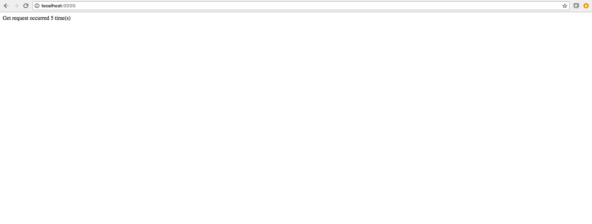

# Flask template web server
> Simple web server written in **flask** micro-web framework.
> It allows to count amount of web hits (GET requests) on a server.

## Tools
- python3.6+
- [flask](https://flask.palletsprojects.com)

## Usage
```bash
~ python server.py
```

## Demo


## Run tests

Run **unit** tests from shell in the root directory of the repository:
```bash
~ pytest -v tests/unitests
```

Run **functional** tests from shell in the root directory of the repository:
```bash
~ pytest -v tests/functional
```

### Contributing

- clone the repository
- configure Git for the first time after cloning with your name and email
  ```bash
  git config --local user.name "Volodymyr Yahello"
  git config --local user.email "vyahello@gmail.com"
  ```
- `python3.6` is required to run the code
- run `pip install -r requirements.txt` to install all require python packages
