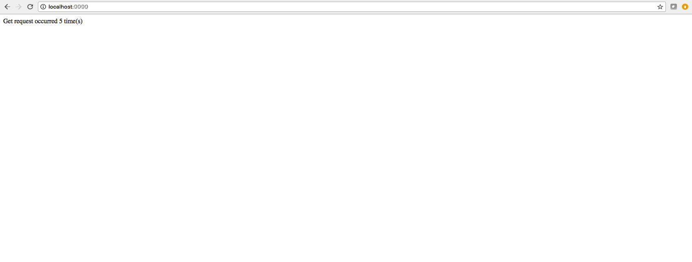

# Flask template web server
> Simple web server written in **flask** micro-web framework.
> It allows to count amount of web hits (GET requests) on a server.

## Tools
- python3.9+
- [flask](https://flask.palletsprojects.com)

## Usage
```bash
python3 server.py
```

## Demo


## Run tests

Run **unit** tests from shell in the root directory of the repository:
```bash
pytest -v tests/unittests
```

Run **functional** tests from shell in the root directory of the repository:
```bash
pytest -v tests/functional
```

### Contributing

- clone the repository
- configure Git for the first time after cloning with your name and email
  ```bash
  git config --local user.name "vyahello"
  git config --local user.email "vyahello@gmail.com"
  ```
- `python3.9+` is required to run the code
- run `pip install -r requirements.txt` to install required python packages
